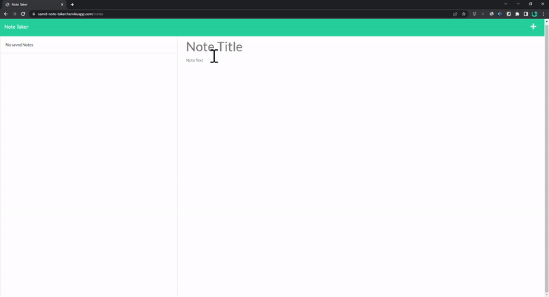

<h1>11 Express.js: Note Taker </h1>
  
  <br />
  
  Here is a GIF of Note Taker application working:
    <br />


## Heroku Deployment Link:

Heroku Link: https://samd-note-taker.herokuapp.com/notes 
  
  ## Description
   An Express.js based application that instantiates a backend server for taking (and deleting) notes via HTML frontend 
   
  ## Challenges

Once I was able to wrap my mind around CRUD principles and understanding the role of an Express server with serving up HTML pages and API calls then things becaming pretty clear in what needed to be developed in order to get the application to work. And as usual Google is always my best friend!

## User Story

```
AS A small business owner
I WANT to be able to write and save notes
SO THAT I can organize my thoughts and keep track of tasks I need to complete

```

## Acceptance Criteria

```
GIVEN a note-taking application
WHEN I open the Note Taker
THEN I am presented with a landing page with a link to a notes page
WHEN I click on the link to the notes page
THEN I am presented with a page with existing notes listed in the left-hand column, plus empty fields to enter a new note title and the note’s text in the right-hand column
WHEN I enter a new note title and the note’s text
THEN a Save icon appears in the navigation at the top of the page
WHEN I click on the Save icon
THEN the new note I have entered is saved and appears in the left-hand column with the other existing notes
WHEN I click on an existing note in the list in the left-hand column
THEN that note appears in the right-hand column
WHEN I click on the Write icon in the navigation at the top of the page
THEN I am presented with empty fields to enter a new note title and the note’s text in the right-hand column

```
   
  ## Table of Contents
  - [Description](#description)
  - [Installation](#installation)
  - [Usage](#usage)
  - [License](#license)
  - [Contributors](#contributors)
  - [Tests](#tests)
  - [Questions](#questions)
  ## Installation
   The applications requires npm install with 'path', 'fs', 'express', and 'uuid' packages. Application is then delpoyed using Heroku Framework.
  ## Usage
   Create and delete notes at will with ability to review previously entered notes.
  ## License
  
  <br />
  MIT License URL:   https://opensource.org/licenses/MIT. 
  ## Contributors
   Sam De Marco
  ## Tests
  N/A 
  ## Questions
   Email<br />
  <br />
  My GitHub: [Samdemarco](https://github.com/Samdemarco)

  Contact me via email for any issues: sam.demarco@gmail.com<br /><br />
